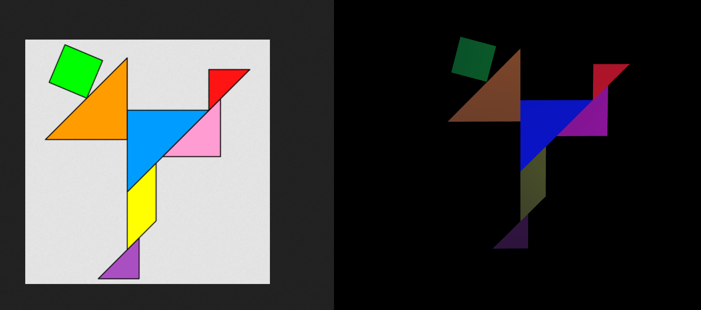
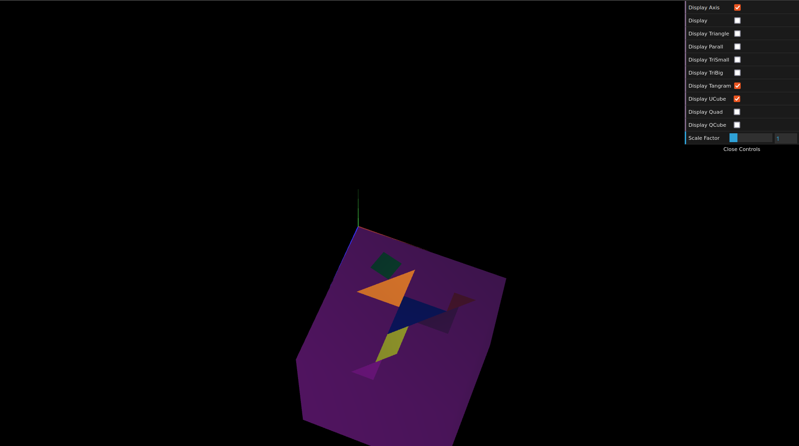
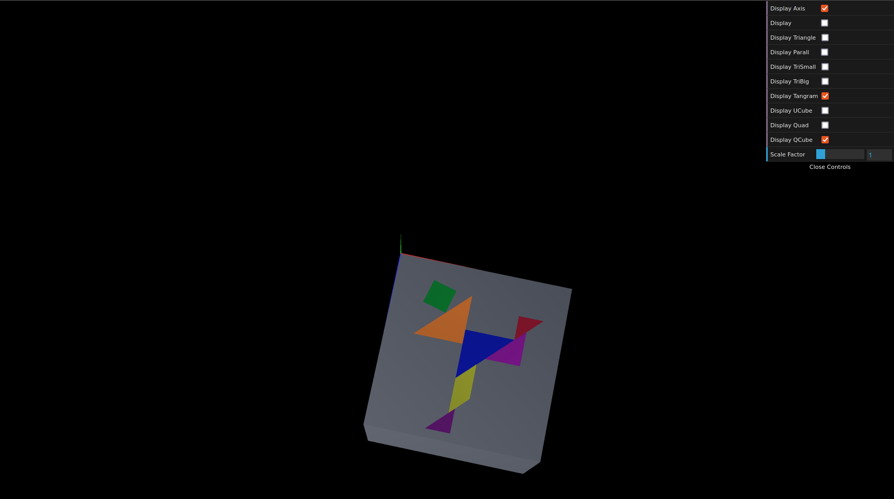

# CG 2022/2023

## Group T02G04

## TP 2 Notes

- In exercise 1 we learned to work with geometric transformations in WebGL (matrix multiplications operations and vectors)

- In exercise 2 we explored some more transformations, including applying a rotation to all objects

- In exercise 3 we observed a different way to make the same cubic shape

