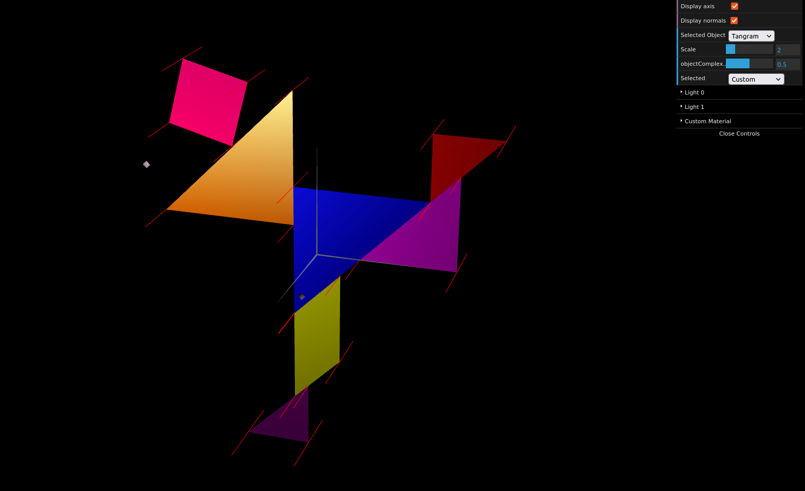
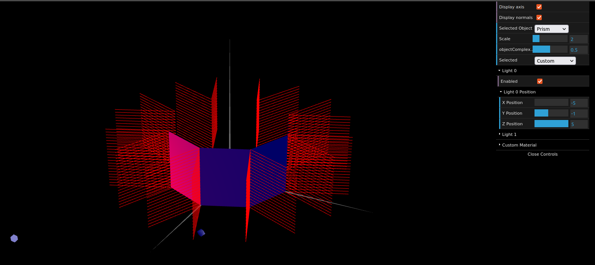
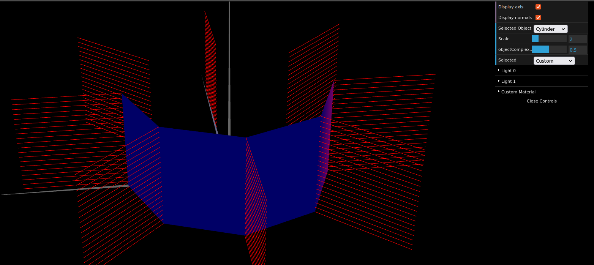

# CG 2022/2023

## Group T02G04

## TP 3 Notes

- In exercise 1 we learned how to work with the ambient and diffuse lights

- In exercise 2 we played more with the specular light and created materials with different properties for each piece of our tangram

- In exercise 3 we moved from hardcoding the vertices, normals and indices to using a trigonometric calcs to generate them

- In exercise 4 we were presented a different look to exercise 3, so that the lights change what the superficie of the prisma looks like, to look more natural rounded.

