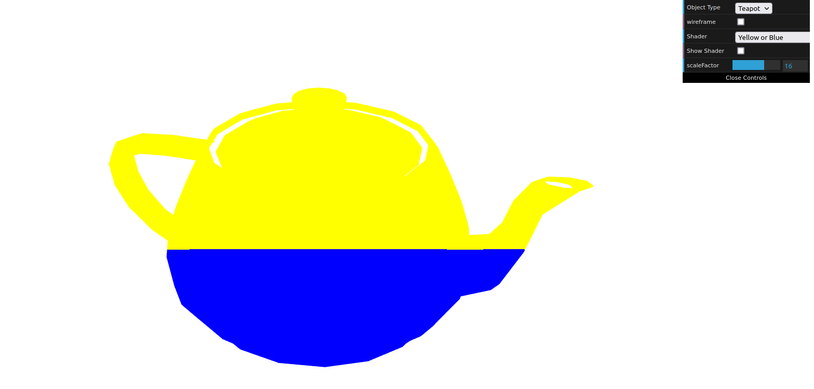
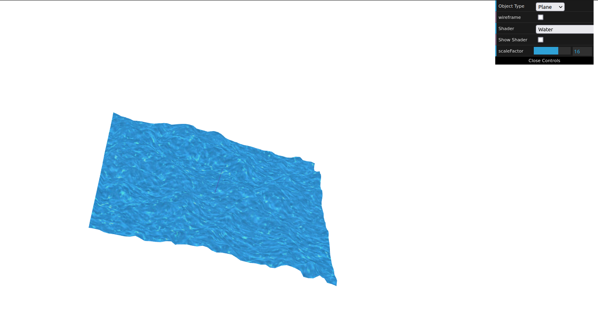

# CG 2022/2023

## Group T02G04

## TP 5 Notes

(add your main observations/remarks about your experiments here, in a bulleted list, and remove this line. Some examples below)

- In exercise 1 we created fragment and vertex shaders to color the fragments based on their position in the window.

- In exercise 2 we created a new fragment shader to grayscal the color.

- In exercise 3 we created a water effect using an image as a heightmap of the water texture.

